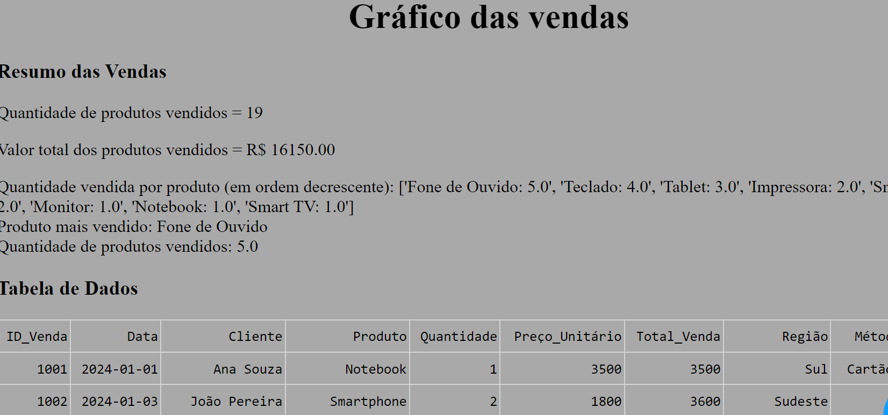
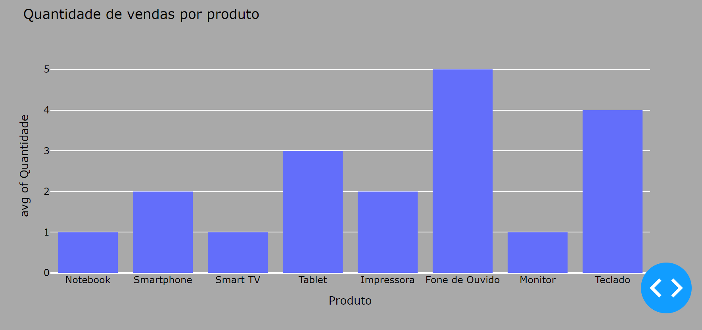
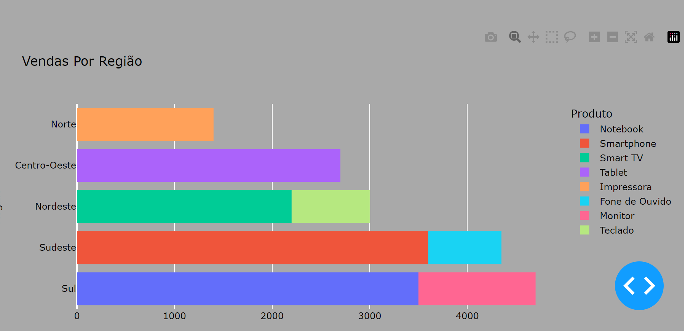
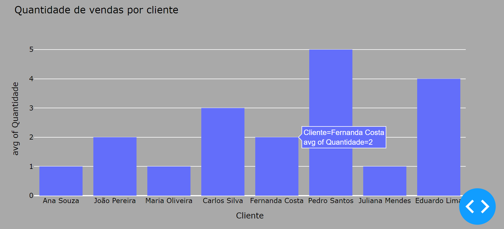

📊 Análise de Vendas com Dash e Plotly

📌 Descrição

Este projeto é uma aplicação interativa desenvolvida com Python, Dash e Plotly para visualizar e analisar dados de vendas a partir de um arquivo CSV. Ele permite obter informações detalhadas sobre a quantidade total de produtos vendidos, o valor total das vendas e os produtos mais vendidos, além de gerar gráficos dinâmicos para melhor compreensão dos dados.

🎥 Demonstração

 

🚀 Recursos (Features)

📈 Visualização gráfica interativa com Plotly

📊 Tabela dinâmica com Dash DataTable

📌 Resumo das vendas com informações chaves

📍 Análise de vendas por produto, cliente e região

🛠️ Instalação

1️⃣ Clone este repositório

git clone https://github.com/seuusuario/seurepositorio.git
cd seurepositorio

2️⃣ Crie um ambiente virtual e instale as dependências

python -m venv venv
source venv/bin/activate  # Para Linux/macOS
venv\Scripts\activate  # Para Windows
pip install -r requirements.txt

3️⃣ Execute a aplicação

python nome_do_arquivo.py

A aplicação será iniciada em http://127.0.0.1:8050/.

📌 Uso

Depois de iniciar a aplicação, você verá:

Um resumo dos dados de vendas

Uma tabela interativa com os dados

Gráficos dinâmicos para análise detalhada

🛠️ Tecnologias Utilizadas

Python

Dash (para a interface web interativa)

Plotly (para criação de gráficos dinâmicos)

Pandas (para manipulação de dados)

🤝 Contribuição

Se quiser contribuir com este projeto, siga os passos:

Faça um Fork do repositório

Crie um novo branch: git checkout -b minha-feature

Faça suas alterações e commit: git commit -m 'Adiciona nova funcionalidade'

Envie para o repositório remoto: git push origin minha-feature

Abra um Pull Request

📩 Contato

GitHub: https://github.com/luan-sousaa

E-mail: luanbispo.sousa263@gmail.com